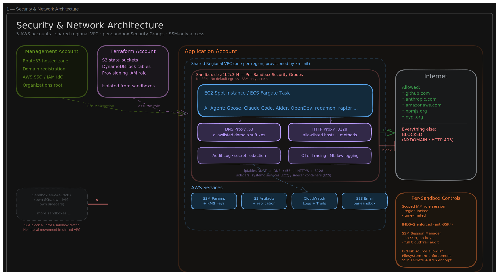
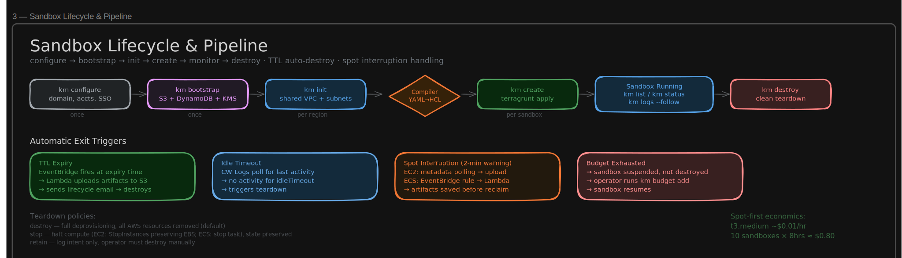
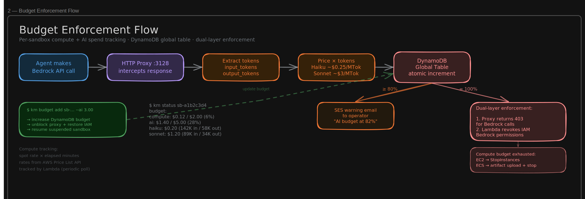

# Klanker Maker (km)
**Hard spending limits for AI agents on AWS — outside the runtime, at cloud scale.**

AWS makes it surprisingly difficult to set hard budget limits. CloudWatch billing alarms are delayed by hours. AWS Budgets can send notifications but can't stop a running workload. There's no native way to say "this IAM role can spend $5 on Bedrock and then stop." For human operators that's annoying. For autonomous AI agents that make their own API calls, loop on failures, and spawn sub-agents — it's a real problem.

Klanker Maker is an open-source platform that puts enforceable spending limits between your AI agents and your AWS bill. It turns declarative YAML profiles into budget-capped, policy-locked AWS sandboxes — each with its own Security Group boundary, IAM role, network allowlists, and a dollar ceiling that actually stops the workload when the money runs out. The enforcement lives in the infrastructure (proxy layer + IAM revocation), not in the agent runtime, so no agent can spend past its budget regardless of how it's built or what SDK it uses.

Define what an agent is allowed to do. Set how much it can spend on compute and AI tokens. Walk away.


<p align="center">
  
  <br />
  <sub>Art by Mike Wigmore (<a href="https://github.com/mikewigmore">@mikewigmore</a>)</sub>
</p>


```
$ km create restricted-dev.yaml
  sandbox: sb-a1b2c3d4
  substrate: ec2 (spot)
  budget: $2.00 compute / $5.00 AI
  ttl: 8h
  egress: 6 hosts allowlisted
  ready in 47s

$ km status sb-a1b2c3d4
  compute: $0.12 / $2.00  (6%)
  ai:      $1.40 / $5.00  (28%)
  uptime:  2h 14m / 8h TTL
  spot:    running (us-east-1b)
```

## Why This Exists

The agent ecosystem is exploding. My GitHub stars tell the story - in the last few months alone I've starred:

**Coding agents** that need real compute, real network, and real credentials:
- [Goose](https://github.com/block/goose) - Block's autonomous agent that installs deps, edits files, runs tests, orchestrates workflows
- [Aider](https://github.com/Aider-AI/aider) - AI pair programming in your terminal with automatic git commits
- [OpenDev](https://github.com/opendev-to/opendev) - open-source coding agent in the terminal
- [open-swe](https://github.com/langchain-ai/open-swe) - LangChain's asynchronous coding agent
- [DeepCode](https://github.com/HKUDS/DeepCode) - agentic coding for Paper2Code, Text2Web, Text2Backend
- [deepagents](https://github.com/langchain-ai/deepagents) - LangGraph harness with planning, filesystem, and sub-agent spawning

**Multi-agent orchestrators** that spawn fleets of workers:
- [agent-orchestrator](https://github.com/ComposioHQ/agent-orchestrator) - parallel coding agents with autonomous CI fixes and code reviews
- [nanoclaw](https://github.com/qwibitai/nanoclaw) - lightweight agent on Anthropic's Agent SDK, runs in containers
- [openclaw](https://github.com/openclaw/openclaw) - personal AI assistant across platforms
- [pi-mono](https://github.com/badlogic/pi-mono) - coding agent CLI, unified LLM API, Slack bot, vLLM pods
- [gobii-platform](https://github.com/gobii-ai/gobii-platform) - always-on AI workforce
- [autoresearch](https://github.com/karpathy/autoresearch) - Karpathy's agents running research on single-GPU training automatically

**Security and red-team agents** that *definitely* need containment:
- [redamon](https://github.com/samugit83/redamon) - AI-powered red team framework, recon to exploitation, zero human intervention
- [raptor](https://github.com/gadievron/raptor) - turns Claude Code into an offensive/defensive security agent
- [hexstrike-ai](https://github.com/0x4m4/hexstrike-ai) - 150+ cybersecurity tools orchestrated by AI agents
- [strix](https://github.com/usestrix/strix) - open-source AI hackers that find and fix vulnerabilities
- [shannon](https://github.com/KeygraphHQ/shannon) - autonomous white-box AI pentester for web apps and APIs
- [EVA](https://github.com/ARCANGEL0/EVA) - AI-assisted penetration testing agent

**Sandbox platforms** solving the same problem from different angles:
- [agent-sandbox](https://github.com/kubernetes-sigs/agent-sandbox) - Kubernetes SIG for isolated agent runtimes
- [E2B](https://github.com/e2b-dev/E2B) - secure cloud environments for enterprise agents
- [OpenSandbox](https://github.com/alibaba/OpenSandbox) - Alibaba's sandbox platform with Docker/K8s runtimes
- [void-box](https://github.com/the-void-ia/void-box) - composable agent runtime with enforced isolation
- [monty](https://github.com/pydantic/monty) - Pydantic's minimal, secure Python interpreter in Rust for AI

Every one of these projects needs *somewhere safe to run*. The common pattern is either "trust the agent" (bad) or "containerize it locally" (insufficient - no real cloud resources, no real credentials, no real network). What's missing is **cloud-native physical isolation** - a real VPC, real IAM boundaries, real network controls, with a budget ceiling that prevents a $10 experiment from becoming a $10,000 AWS bill.

That's what Klanker Maker builds. The sandbox is a **compiled policy object** - you declare the constraints and the infrastructure is the compiled artifact:

- **Budget ceiling** - set a dollar cap for compute and AI API spend per sandbox. At 80% you get a warning email. At 100% the sandbox is suspended, not destroyed - top it up and resume.
- **Network allowlists** - DNS and HTTP proxies enforce which hosts the agent can reach. Everything else is blocked at the proxy layer *and* at the Security Group layer. Two walls, not one.
- **Scoped identity** - each sandbox gets its own IAM role session, region-locked, time-limited, with only the permissions the profile declares.
- **Automatic lifecycle** - TTL auto-destroy, idle timeout, artifact upload on exit (including on spot interruption), and email notifications for every lifecycle event.
- **Spot-first economics** - EC2 Spot and Fargate Spot by default. A `t3.medium` spot instance in `us-east-1` costs ~$0.01/hr. Run 10 agent sandboxes for a full workday for under $1 in compute.

The difference between Klanker Maker and the other sandbox platforms: this is **pure AWS infrastructure** - no orchestration layer to trust, no shared runtime, no container escape surface. Each region has a shared VPC (provisioned once by `km init`), and every sandbox gets its own Security Groups, IAM role, and sidecar enforcement. The isolation is at the network policy and identity layer, backed by real AWS primitives.

## AWS Account Architecture

Klanker Maker follows AWS Organizations best practices, supporting either a **three-account** or **two-account** topology. In both models, sandboxes run in a dedicated application account - completely separated from the account that owns the domain and applies SCP policies.

<p align="center">
  
</p>

### Why Three Accounts?

| Account | Role | What Lives Here | Why Separate |
|---------|------|----------------|--------------|
| **Management** | DNS, identity, org root | Route53 hosted zone, domain registration, AWS SSO, Organizations root | Domain and identity are org-wide - they don't belong in a sandbox blast radius |
| **Terraform** | State and provisioning | S3 state buckets, DynamoDB lock tables, cross-account provisioning role | Terraform state contains every resource ARN and secret path - isolating it limits exposure if the application account is compromised |
| **Application** | Sandbox execution | Regional VPCs, EC2/ECS instances, IAM sandbox roles, SES, Lambda handlers, DynamoDB budget table, S3 artifacts, CloudWatch Logs | This is where agents run - if an agent escapes its sandbox, it can only reach resources in this account, not state or DNS |

In a **two-account topology**, the Terraform and Application accounts are the same - set both account IDs to the same value during `km configure`. This is simpler for development while keeping the management account separate for SCP policies and DNS.

The operator authenticates via **AWS SSO** with named profiles:

```bash
# Authenticate to all three accounts
aws sso login --profile klanker-management     # DNS, domain
aws sso login --profile klanker-terraform      # State, provisioning
aws sso login --profile klanker-application    # VPC/network init
```

The `km` CLI selects the right profile per command:

| Command | AWS Profile | Account |
|---------|-------------|---------|
| `km configure` (`km conf`) | — | No AWS access needed; writes `km-config.yaml` |
| `km configure github` | — | Configures GitHub App token integration (manual SSM setup) |
| `km configure github --setup` | `klanker-terraform` | One-click GitHub App creation via manifest flow + auto SSM storage |
| `km configure github --discover` | `klanker-terraform` | Auto-discover installation ID from existing App credentials in SSM |
| `km github` | `klanker-terraform` | Shortcut for `km configure github --setup` |
| `km bootstrap` | `klanker-terraform` | Terraform - deploys SCP containment policy via management account |
| `km bootstrap --show-prereqs` | — | Prints the IAM role and trust policy to create in management account |
| `km init` | `klanker-application` | Application - builds Lambdas/sidecars, provisions shared VPC/network |
| `km uninit` | `klanker-application` | Application - tears down all shared regional infrastructure |
| `km create` | `klanker-terraform` | Terraform - assumes role into Application to provision |
| `km destroy` | `klanker-terraform` | Terraform - assumes role into Application to teardown |
| `km destroy --remote` | `klanker-terraform` | Dispatches destroy to Lambda via EventBridge |
| `km stop` | `klanker-terraform` | Stop a sandbox's EC2 instance (preserves infrastructure) |
| `km stop --remote` | `klanker-terraform` | Dispatches stop to Lambda via EventBridge |
| `km extend` | `klanker-terraform` | Extend a sandbox's TTL by a given duration |
| `km extend --remote` | `klanker-terraform` | Dispatches extend to Lambda via EventBridge |
| `km list` | `klanker-terraform` | Reads state from S3 + live EC2 status check |
| `km status` | `klanker-terraform` | Reads state + budget + identity + idle countdown |
| `km logs` | `klanker-terraform` | Tails CloudWatch audit logs for a sandbox |
| `km shell` | `klanker-terraform` | SSM session as restricted `sandbox` user (no sudo) |
| `km shell --root` | `klanker-terraform` | SSM session as root (operator access) |
| `km shell --ports` | `klanker-terraform` | SSM port forwarding (Docker-style syntax) |
| `km budget add` | `klanker-terraform` | Add compute or AI budget to a sandbox |
| `km otel` | `klanker-terraform` | OTEL telemetry + AI spend summary (--prompts, --events, --tools, --timeline) |
| `km doctor` | `klanker-terraform` | Validates platform health across all accounts (12 checks) |

### Platform Configuration

Klanker Maker is forkable. All platform-specific values - domain, account IDs, SSO URL, region preferences - are configurable via `km configure`:

```bash
km configure
  Domain:                 mysandboxes.example.com
  Management account ID:  111111111111
  Terraform account ID:   222222222222
  Application account ID: 333333333333
  SSO start URL:          https://myorg.awsapps.com/start
  Primary region:         us-east-1
```

No hardcoded account IDs. No hardcoded domains. A fork with a different domain works end-to-end after `km configure`.

## Security Model

Klanker Maker uses **explicit allowlists everywhere** - if it's not in the policy, it's denied. There is no "default allow."

### No SSH. No Bastion. No Keys.

Sandboxes are accessed exclusively through **AWS SSM Session Manager**:

- **Zero open inbound ports** - Security Groups have no SSH ingress rules. Port 22 doesn't exist.
- **No SSH keys to manage** - no generation, rotation, distribution, or leaked keys on GitHub.
- **IAM-gated access** - who can connect is controlled by IAM policy, not by who has a `.pem` file.
- **Full session audit** - every session and every command is logged to CloudTrail and CloudWatch. There is no "off the record."
- **No bastion hosts** - no jump boxes, no VPN. SSM connects through the agent, even in private subnets with no internet access.

### SCP Sandbox Containment

Even if a sandbox IAM role is misconfigured — or an agent finds a way to escalate within the application account — the **Service Control Policy (SCP)** acts as an org-level backstop that cannot be bypassed from within the account. SCPs are enforced by AWS Organizations at the API layer, before IAM policy evaluation.

The `km-sandbox-containment` SCP is deployed to the management account and attached to the application account. It contains 6 deny statements:

| Statement | What It Blocks | Why It Matters |
|-----------|---------------|----------------|
| **DenyInfraAndStorage** | SG mutation, VPC/subnet/route/IGW/NAT creation, VPC peering, Transit Gateway, snapshot/image creation and export | A compromised sandbox cannot open new network paths, create escape routes to the internet, peer with other VPCs, or exfiltrate data via EBS snapshots or AMI copies |
| **DenyInstanceMutation** | `RunInstances`, `ModifyInstanceAttribute`, `ModifyInstanceMetadataOptions` | Prevents launching rogue EC2 instances or disabling IMDSv2 (which would enable SSRF credential theft via the metadata service) |
| **DenyIAMEscalation** | `CreateRole`, `AttachRolePolicy`, `DetachRolePolicy`, `PassRole`, `AssumeRole` | Blocks the classic IAM privilege escalation chain: create a new admin role → attach `AdministratorAccess` → assume it |
| **DenySSMPivot** | `SendCommand`, `StartSession` | Prevents a compromised sandbox from using SSM to pivot laterally into other sandbox instances |
| **DenyOrgDiscovery** | `organizations:List*`, `organizations:Describe*` | Prevents enumeration of the org structure, other accounts, and OUs — information useful for targeting lateral movement |
| **DenyOutsideRegion** | All regional actions outside allowed regions | Region-locks the entire account to prevent resource creation in regions where there's no monitoring or VPC infrastructure |

Each statement uses `ArnNotLike` conditions to carve out trusted operator roles (SSO, provisioner, lifecycle handlers). The carve-outs are minimal — for example, the budget enforcer Lambda only gets an IAM carve-out (it needs `AttachRolePolicy`/`DetachRolePolicy` to revoke Bedrock access), not a network or instance carve-out.

The SCP is deployed via `km bootstrap --dry-run=false`. Run `km bootstrap --show-prereqs` to see the exact IAM role and trust policy that must be created in the management account first.

### Defense in Depth

| Layer | Control | Enforcement |
|-------|---------|-------------|
| **Organization** | SCP sandbox containment | Org-level deny on SG/network/IAM/instance/SSM/region — cannot be bypassed from within the account |
| **Account** | Three-account isolation | Sandbox blast radius limited to Application account; state and DNS unreachable |
| **Network** | VPC Security Groups | Primary boundary - blocks all egress except proxy paths |
| **DNS** | DNS proxy sidecar | Allowlisted suffixes only; non-matching → NXDOMAIN |
| **HTTP** | HTTP proxy sidecar | Allowlisted hosts only; non-matching → 403 Forbidden |
| **Identity** | Scoped IAM sessions | Region-locked, time-limited, minimal permissions |
| **Email** | Ed25519 signed email | Per-sandbox key pairs; profile-controlled signing, verification, and encryption policies |
| **Secrets** | SSM Parameter Store + KMS | Allowlisted refs only; per-sandbox encryption key with auto-rotation |
| **Metadata** | IMDSv2 enforced | Token-required; blocks SSRF credential theft via instance metadata |
| **Source** | GitHub App scoped tokens | Per-repo, per-ref, per-permission; short-lived installation tokens refreshed via Lambda |
| **Filesystem** | Path-level enforcement | Writable vs read-only directories at OS level |
| **Audit** | Command + network logging | Secret-redacted; delivered to CloudWatch/S3 |
| **Telemetry** | OTEL observability | Claude Code prompts, tool calls, API requests, cost metrics → OTel Collector → S3 |
| **Budget** | Compute + AI spend tracking | DynamoDB real-time metering; proxy 403 + IAM revocation at ceiling |

### Architecture Diagrams

Editable source: [`docs/sandbox-architecture.excalidraw`](docs/sandbox-architecture.excalidraw) - open in [excalidraw.com](https://excalidraw.com) or the VS Code Excalidraw extension.

## How It Works

<p align="center">
  
</p>

1. **Configure** with `km configure` (alias: `km conf`) - set your domain, account IDs, SSO URL, region (once)
2. **Bootstrap** with `km bootstrap` - deploys SCP, KMS key, artifacts bucket (once)
3. **Initialize** with `km init --region us-east-1` - builds Lambdas/sidecars, provisions VPC, DynamoDB, SES, TTL handler (once per region)
4. **Check** with `km doctor` - validates all 12 platform health checks, assumes cross-account role for SCP verification
5. **Define** a SandboxProfile in YAML - budget, lifecycle, network policy, identity, sidecars
6. **Validate** with `km validate <profile.yaml>`
7. **Create** with `km create <profile>` - compiles to Terragrunt inputs, provisions infrastructure, shows elapsed time
8. **Monitor** with `km list` (numbered, live EC2 status) / `km status` (budget, identity, idle countdown with color) / `km logs` / `km otel` (telemetry + spend)
9. **Connect** with `km shell 1` (restricted user) or `km shell 1 --root` (operator access)
10. **Port forward** with `km shell 1 --ports 8080:80,3000` (Docker-style syntax)
11. **Extend** with `km extend 1 2h` - add time before TTL expires
12. **Stop** with `km stop 1` - stop instance, preserve infrastructure for restart
13. **Top-up** with `km budget add 1 --compute 5.00` - add compute or AI budget
14. **Destroy** with `km destroy 1` (local) or `km destroy 1 --remote` (Lambda-dispatched)
15. **Teardown** with `km uninit --region us-east-1` - reverse of init, destroys all regional infrastructure

## SandboxProfile

Profiles use a Kubernetes-style schema at `klankermaker.ai/v1alpha1`. Here's what a realistic agent sandbox looks like:

```yaml
apiVersion: klankermaker.ai/v1alpha1
kind: SandboxProfile
metadata:
  name: restricted-dev
  description: Budget-capped development sandbox with network filtering
extends: open-dev

spec:
  lifecycle:
    ttl: 8h
    idleTimeout: 2h
    teardownPolicy: destroy

  runtime:
    substrate: ec2
    instanceType: t3.medium
    spot: true

  budget:
    compute:
      maxSpendUSD: 2.00
    ai:
      maxSpendUSD: 5.00
    warningThreshold: 0.80

  network:
    egress:
      allowedDNSSuffixes:
        - "*.github.com"
        - "*.amazonaws.com"
      allowedHosts:
        - host: "api.openai.com"
          methods: [GET, POST]
        - host: "api.anthropic.com"
          methods: [GET, POST]

  identity:
    sessionDuration: 1h
    regionLock: [us-east-1]

  sourceAccess:
    github:
      allowedRepos:
        - org: "mycompany"
          repo: "*"
          refs: ["main", "develop"]
          permissions: [clone, fetch, push]

  secrets:
    allowedRefs:
      - "arn:aws:ssm:us-east-1::parameter/sandbox/api-key"

  sidecars:
    dnsProxy: { enabled: true }
    httpProxy: { enabled: true }
    auditLog: { enabled: true }
    tracing: { enabled: true }

  email:
    signing: required
    verifyInbound: required
    encryption: optional

  artifacts:
    paths: ["/workspace/output/**"]
    maxSizeMB: 100
    replicationRegion: us-west-2

  observability:
    logDestination: cloudwatch
    commandLog: true
    networkLog: true
```

### Built-in Profiles

| Profile | TTL | Network | Budget | Use Case |
|---------|-----|---------|--------|----------|
| `open-dev` | 24h | Broad allowlist (npm, PyPI, Docker Hub, GitHub) | Operator-set | General development, prototyping |
| `restricted-dev` | 8h | Narrow allowlist, GET/POST only | Operator-set | Agent coding tasks with audit trail |
| `hardened` | 4h | AWS services only | Operator-set | Production-adjacent testing |
| `sealed` | 1h | No egress | Operator-set | Offline analysis, air-gapped execution |

Profiles support **inheritance** via `extends` - start from a base and override what you need.

## Running Agents in Sandboxes

Klanker Maker is workload-agnostic - any agent that runs on Linux works inside a sandbox. Here's how the controls map to real agent workloads:

| Agent | What It Does | Which Controls Matter |
|-------|-------------|----------------------|
| [Goose](https://github.com/block/goose) | Installs deps, edits files, runs tests, orchestrates workflows | **Budget cap** - prevents runaway Bedrock/API costs when Goose loops |
| [Aider](https://github.com/Aider-AI/aider) | AI pair programming with auto git commits | **Source access** - controls which repos it can push to |
| [agent-orchestrator](https://github.com/ComposioHQ/agent-orchestrator) | Spawns parallel coding agents, handles CI fixes autonomously | **Budget + TTL** - caps fleet cost; each spawned worker inherits the sandbox ceiling |
| [deepagents](https://github.com/langchain-ai/deepagents) | Planning + filesystem + sub-agent spawning via LangGraph | **Network allowlist** - limits where sub-agents can reach |
| [open-swe](https://github.com/langchain-ai/open-swe) | Async coding agent that clones, patches, and PRs | **Source access** - allowlist repos + refs; block push to protected branches |
| [redamon](https://github.com/samugit83/redamon) | Automated red team: recon → exploitation → post-exploitation | **Sealed profile** - air-gapped, no egress, full audit trail |
| [raptor](https://github.com/gadievron/raptor) | Claude Code as an offensive security agent | **Hardened profile** - minimal egress, short TTL, every command logged |
| [autoresearch](https://github.com/karpathy/autoresearch) | Agents running research on GPU training | **Compute budget** - prevents a runaway training loop from burning hours of GPU |
| [nanoclaw](https://github.com/qwibitai/nanoclaw) | Anthropic Agent SDK agent connected to messaging apps | **HTTP proxy** - controls which external APIs the agent can call |
| [gobii-platform](https://github.com/gobii-ai/gobii-platform) | Always-on AI workforce | **Idle timeout** - shuts down workers that stop producing; artifact upload preserves state |

### Multi-Agent Orchestration via Signed Email

Sandboxes communicate through **digitally signed email** (SES + Ed25519). Each sandbox gets a unique address derived from its ID (e.g., `sb-a1b2c3d4@sandboxes.klankermaker.ai`) and an Ed25519 key pair at creation time.

- **Signing** — outbound emails are signed with the sender's Ed25519 private key (stored in SSM, KMS-encrypted). The signature and sender ID are attached as `X-KM-Signature` and `X-KM-Sender-ID` headers.
- **Verification** — the receiver fetches the sender's public key from the `km-identities` DynamoDB table and verifies the signature. When `verifyInbound: required`, unsigned or invalid emails are rejected.
- **Encryption** — optional X25519 key exchange (NaCl box). When `encryption: required`, the sender encrypts the body with the recipient's public key. When `encryption: optional`, it encrypts if the recipient has a published key, plaintext otherwise.

Profile controls (`spec.email.signing`, `spec.email.verifyInbound`, `spec.email.encryption`) govern policy per sandbox. Hardened and sealed profiles default to `signing: required`; open-dev defaults to `signing: optional`.

This enables multi-agent pipelines where each worker is physically isolated but logically connected — with cryptographic proof of sender identity and optional confidentiality.

## Substrates

| Substrate | How It Works | Cost |
|-----------|-------------|------|
| **EC2 Spot** (default) | Shared regional VPC, per-sandbox SG, spot instance, SSM access, sidecar systemd services | ~$0.01/hr for t3.medium |
| **EC2 On-Demand** | Same as above, guaranteed capacity | ~$0.04/hr for t3.medium |
| **ECS Fargate Spot** | Fargate task with sidecar containers, service discovery | ~$0.01/hr for 1 vCPU / 2GB |
| **ECS Fargate** | Same as above, guaranteed capacity | ~$0.04/hr for 1 vCPU / 2GB |

Spot interruption handlers automatically upload artifacts to S3 before instances are reclaimed.

## Budget Enforcement

Budget enforcement tracks two spend pools per sandbox, stored in a **DynamoDB global table** replicated to every region where agents run. Reads from within the sandbox hit the local regional replica with sub-millisecond latency.

<p align="center">
  
</p>

### Compute Budget

Tracked as spot rate x elapsed minutes, sourced from the AWS Price List API at sandbox creation. When the compute budget is exhausted, the sandbox is *suspended* - not destroyed:

- **EC2**: `StopInstances` preserves the EBS volume. No compute charges accrue while stopped.
- **ECS Fargate**: Artifacts are uploaded, then the task is stopped. Re-provision from the stored S3 profile on top-up.

### AI Budget (Bedrock + Anthropic Direct)

The HTTP proxy sidecar intercepts every AI API response — both **Bedrock** (`invoke-with-response-stream`) and **Anthropic direct** (`api.anthropic.com`, for Claude Code Max/API key users). A tee-reader streams data through to the client without blocking, captures the full response, then extracts token counts asynchronously:

- **Bedrock streaming**: base64-decodes `{"bytes":"<b64>"}` event-stream wrappers to find `message_start`/`message_delta` payloads
- **Anthropic SSE**: parses `data:` lines for the same event types
- **Non-streaming**: reads `usage` from the JSON response body

Tokens are priced against static model rates and atomically incremented in the DynamoDB spend counter.

**Dual-layer enforcement** at 100%:

1. **Proxy layer** (immediate) - HTTP proxy returns 403 for subsequent AI calls
2. **IAM layer** (backstop) - a Lambda revokes the sandbox IAM role's Bedrock permissions, catching SDK/CLI calls that bypass the proxy

`km status` shows per-model AI spend grouped by provider:

```
$ km status sb-a1b2c3d4
  ...
  budget:
    compute:  $0.12 / $2.00  (6%)
    ai:       $1.40 / $5.00  (28%)
      anthropic.claude-sonnet-4-6:  $0.85  (89K in / 34K out)   # Bedrock
      claude-opus-4-6:              $0.55  (12K in / 8K out)     # Max/API
```

### OTEL Telemetry

Claude Code running inside sandboxes exports OpenTelemetry telemetry (prompts, tool calls, API requests, token usage, cost metrics) through an OTel Collector sidecar to S3. Profile-controlled via `spec.observability.claudeTelemetry`:

```yaml
observability:
  claudeTelemetry:
    enabled: true        # master switch
    logPrompts: true     # include actual prompt text
    logToolDetails: true # include tool parameters (bash commands, file paths)
```

`km otel` provides five views into this data:

```
$ km otel sb-a1b2c3d4              # summary: budget + S3 + metrics
$ km otel sb-a1b2c3d4 --prompts    # user prompts with timestamps
$ km otel sb-a1b2c3d4 --events     # full event stream
$ km otel sb-a1b2c3d4 --tools      # tool calls with params + duration
$ km otel sb-a1b2c3d4 --timeline   # conversation turns with per-turn cost
```

### Warnings and Top-Up

At 80% (configurable via `spec.budget.warningThreshold`) of either pool, the operator receives an email via SES.

```
$ km budget add sb-a1b2c3d4 --ai 3.00
  ai budget: $5.00 → $8.00
  proxy: unblocked
  iam: restored
  status: running
```

Top-up unblocks the proxy, restores IAM permissions, and restarts suspended compute - all in one command.

## Architecture

```
km CLI / ConfigUI
├── cmd/km/                  CLI entry point
├── cmd/configui/            Web dashboard (Go + embedded HTML)
├── cmd/ttl-handler/         Lambda: TTL expiry + artifact upload
├── internal/app/cmd/        Cobra commands (configure, bootstrap, init, uninit, validate, create, destroy, stop, extend, list, status, logs, budget, shell, doctor, otel)
├── internal/app/config/     Configuration (config.yaml, env vars, CLI flags)
├── pkg/
│   ├── profile/             SandboxProfile schema, validation, inheritance
│   ├── compiler/            Profile → Terragrunt artifacts (EC2 + ECS paths)
│   ├── aws/                 SDK helpers (S3, SES, CloudWatch, EC2 metadata, DynamoDB, identity/signing)
│   ├── terragrunt/          Runner + per-sandbox state isolation
│   └── lifecycle/           TTL scheduling, idle detection, teardown
├── sidecars/
│   ├── dns-proxy/           DNS allowlist filter (UDP/TCP:53)
│   ├── http-proxy/          HTTP allowlist filter (TCP:3128) + AI token metering (Bedrock + Anthropic)
│   ├── audit-log/           Command + network log router with secret redaction
│   └── tracing/             OTel Collector sidecar (logs, metrics → S3)
├── profiles/                Built-in YAML profiles (open-dev → sealed)
└── infra/
    ├── modules/             Terraform modules
    │   ├── network/         VPC, subnets, security groups
    │   ├── ec2spot/         Spot + on-demand instances, IMDSv2, IAM
    │   ├── ecs-cluster/     ECS cluster, Fargate Spot capacity provider
    │   ├── ecs-task/        Task definitions with sidecar containers
    │   ├── ecs-service/     Service deployment + service discovery
    │   ├── ecs-spot-handler/  Lambda: Fargate Spot interruption → artifact upload
    │   ├── secrets/         SSM Parameter Store + KMS encryption
    │   ├── ses/             SES domain, DKIM, inbound email → S3
    │   ├── scp/             SCP sandbox containment (deployed to management account)
    │   ├── dynamodb-budget/ Budget enforcement table
    │   ├── dynamodb-identities/ Sandbox identity public key table
    │   ├── s3-replication/  Cross-region artifact replication
    │   └── ttl-handler/     Lambda: TTL expiry → artifacts + email + self-cleanup
    └── live/                Terragrunt hierarchy (site.hcl, per-sandbox isolation)
```

## Quick Start

```bash
# Install
go install github.com/whereiskurt/klankrmkr/cmd/km@latest

# Configure your platform (once)
km configure    # or: km conf

# See what's needed in the management account before bootstrap
km bootstrap --show-prereqs

# Bootstrap SCP + KMS + artifacts bucket (once)
km bootstrap --dry-run=false

# Initialize the region — builds Lambdas, sidecars, deploys infra (once per region)
km init --region us-east-1

# Check platform health (12 checks)
km doctor

# Create a sandbox (shows progress dots + elapsed time)
km create profiles/restricted-dev.yaml
km create --on-demand profiles/sealed.yaml  # skip spot, use on-demand

# List sandboxes (numbered, live EC2 status)
km list

# Status with budget, identity, idle countdown
km status 1

# Connect as restricted user (no sudo)
km shell 1
km shell 1 --root    # operator access

# Port forward (Docker-style)
km shell 1 --ports 8080           # localhost:8080 → remote:8080
km shell 1 --ports 8080:80,3000   # multiple ports

# Extend TTL
km extend 1 2h

# Stop without destroying
km stop 1

# View audit logs
km logs 1

# OTEL telemetry + AI spend
km otel 1                  # summary
km otel 1 --timeline       # conversation turns with cost
km otel 1 --prompts        # user prompts
km otel 1 --tools          # tool call history

# Destroy (local or remote)
km destroy 1                    # local terragrunt destroy
km destroy 1 --remote --yes     # Lambda-dispatched, no prompt

# Teardown region infrastructure
km uninit --region us-east-1
```

## Documentation

| Document | Description |
|----------|-------------|
| [User Manual](docs/user-manual.md) | Full command reference, walkthroughs (Claude Code, Goose, security agents), profile authoring |
| [Operator Guide](docs/operator-guide.md) | AWS account setup, KMS, S3, SES, Lambda deployment - everything before `km init` |
| [Profile Reference](docs/profile-reference.md) | Complete YAML schema with every field, type, default, and validation rule |
| [Security Model](docs/security-model.md) | Deep dive on each security layer, from VPC to IMDSv2 to secret redaction |
| [Budget Guide](docs/budget-guide.md) | DynamoDB schema, proxy metering, enforcement flow, threshold configuration |
| [Sidecar Reference](docs/sidecar-reference.md) | Each sidecar's config, env vars, log formats, EC2 vs ECS deployment |
| [Multi-Agent Email](docs/multi-agent-email.md) | SES setup, sandbox addressing, cross-sandbox orchestration patterns |
| [ConfigUI Guide](docs/configui-guide.md) | Web dashboard setup, profile editor, secrets management |

## Roadmap

| Phase | Description | Status |
|-------|-------------|--------|
| 1 | Schema, Compiler & AWS Foundation | **Complete** |
| 2 | Core Provisioning & Security Baseline | **Complete** |
| 3 | Sidecar Enforcement & Lifecycle Management | **Complete** |
| 4 | Lifecycle Hardening, Artifacts & Email | **Complete** |
| 5 | ConfigUI Web Dashboard | **Complete** |
| 6 | Budget Enforcement & Platform Configuration | **Complete** |
| 7 | Unwired Code Paths | **Complete** |
| 8 | Sidecar Build & Deployment Pipeline | **Complete** |
| 9 | Live Infrastructure & Operator Docs | **Complete** |
| 10 | SCP Sandbox Containment | **Complete** |
| 11 | Sandbox Auto-Destroy & Metadata Wiring | **Complete** |
| 12 | ECS Budget Top-Up & S3 Replication | **Complete** |
| 13 | GitHub App Token Integration | **Complete** |
| 14 | Sandbox Identity & Signed Email | **Complete** |
| 15 | km doctor — Platform Health Check | **Complete** |
| 16 | Documentation Refresh (Phases 6-15) | **Complete** |
| 17 | Sandbox Email Mailbox & Access Control | **Complete** |
| 18 | Loose Ends — km init, uninit, bootstrap KMS, github-token | **Complete** |
| 19 | Budget Enforcement Wiring — EC2 hard stop, IAM revocation | **Complete** |
| 20 | Anthropic API Metering & Terragrunt Output Suppression | **Complete** |
| 21 | Bug fixes and mini-features — budget precision, polish | **Complete** |
| 22 | Remote Sandbox Dispatch — `km create/destroy/stop/extend --remote` via Lambda | Planned |
| 23 | Email-Driven Operations — operator inbox, email-to-create, safe phrase auth, EventBridge | Planned |
| 24 | Credential Rotation — `km roll creds` for platform and sandbox secrets | Planned |
| 25 | GitHub Source Access Restrictions — repo allowlists, deny-by-default | Planned |
| 26 | Live Operations Hardening — bootstrap, init, TTL, idle, sidecars, CLI polish | **Complete** |
| 27 | Claude Code OTEL Integration — sandbox observability via built-in telemetry | **Complete** |

See [.planning/ROADMAP.md](.planning/ROADMAP.md) for detailed phase breakdowns and success criteria.

## License

TBD
