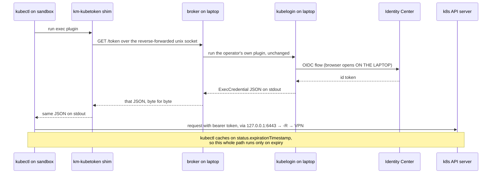

# How `km tunnel k8s` works

**Phase 130 · v0.8.7**

This is the mechanism. For "how do I use it", see [`k8s-reverse-tunnel.md`](k8s-reverse-tunnel.md);
for the decisions and rejected alternatives at design time, see
[`superpowers/specs/2026-08-26-k8s-reverse-tunnel-design.md`](superpowers/specs/2026-08-26-k8s-reverse-tunnel-design.md).

Everything below is worth knowing if you are debugging the tunnel, extending it, or deciding
whether to trust it with a cluster.

---

## 1. The problem, stated precisely

An operator has a Kubernetes cluster that is reachable **only** from their own workstation:

- the OpenVPN route lives on that laptop, and the VPN credential cannot leave it;
- the cluster is self-managed, and `kubectl` authenticates through an OIDC exec plugin
  (`kubelogin`) federated to AWS Identity Center — so getting a token requires a **browser**;
- the cluster is fronted by a **private corporate root CA**, which no stock trust store knows.

They want an agent running in a km sandbox to use `kubectl` against it.

Three constraints make this harder than a port-forward:

1. **The sandbox has no path to the cluster and cannot be given one.** No route, no DNS, no
   VPN credential.
2. **km sandboxes are egress-controlled by design.** A MITM proxy, an eBPF allowlist, and a
   DNS resolver that NXDOMAINs anything not allowlisted.
3. **The credential is interactive and durable.** An SSO refresh token is long-lived and
   mints access; it must never sit on a box an autonomous agent controls.

---

## 2. Why the obvious approaches don't work

Each of these was considered and rejected. If you find yourself proposing one, the reason it
fails is here.

| Approach | Why it fails |
|---|---|
| Run an OpenVPN client on the sandbox | The VPN credential cannot leave the workstation, and the cluster's allowlist is scoped to the operator's assigned VPN IP — a second client gets a different one. |
| Use SSM port forwarding | Both `AWS-StartPortForwardingSession` variants are strictly **local→remote**. Session Manager has no reverse-forward primitive at all. |
| `aws sso login` on the box | Needs a browser, needs the SSO endpoints punched through the egress allowlist, and leaves a **refreshable** token on the sandbox. Strictly worse than the problem. |
| Copy the operator's kubeconfig to the box | Its exec stanza names a plugin that isn't installed, and even if it were, the plugin would need the browser and the VPN. A static token instead would expire in minutes. |
| Reverse-tunnel AWS credentials (`AWS_CONTAINER_CREDENTIALS_FULL_URI`) | Works, and hands the sandbox the operator's **entire SSO role** when the stated need is kubectl against one cluster. |

What's left is: forward the *socket* from the operator's side, and mint credentials *on* the
operator's side.

---

## 3. Transport — three nested tunnels

Because SSM cannot reverse-forward, `-R` has to ride inside SSH, which rides inside the SSM
port-forward km already uses for `km vscode`.

```
  OPERATOR WORKSTATION                                    SANDBOX (EC2)
  ────────────────────                                    ─────────────

  km tunnel k8s
     │
     ├── aws ssm start-session ─────────────────────────▶  sshd :22
     │     AWS-StartPortForwardingSession
     │     binds 127.0.0.1:2223                    (SSM agent, no inbound SG rule)
     │
     └── ssh -p 2223 sandbox@127.0.0.1
           │
           ├─ -R 6443:k8s1.corp:6443 ──────────────────▶  binds box 127.0.0.1:6443
           │    dialled HERE, over the VPN                  (loopback only)
           │
           └─ -R /home/sandbox/.km/kubetoken.sock ─────▶  binds that unix socket
                :/tmp/km-broker-XXXX/broker.sock            (0600, owned by `sandbox`)
```

### The load-bearing property

**`ssh -R` resolves and dials its target on the CLIENT side.** When something on the box
connects to `127.0.0.1:6443`, sshd hands the connection back down the SSH channel, and the
operator's ssh client is what resolves `k8s1.corp` and opens the TCP connection — using the
laptop's resolver and the laptop's VPN routing table.

This is the entire reason the design works. The sandbox needs no route, no DNS entry, and
never consults km's NXDOMAIN-by-default resolver, because from its point of view the cluster
is a loopback socket.

### Why the SSM leg exists at all

The sandbox has no inbound security-group rule and no public SSH. SSM Session Manager is the
only way in, and `km vscode` already established the pattern: sshd is on every box, and each
sandbox has an ed25519 keypair at `~/.km/keys/<id>` written at create time.

`km tunnel` differs from `km vscode start` in one structural way. `km vscode start` runs the
SSM forward in the **foreground** as its final act. Here the forward must stay live
*underneath* an SSH session km owns, so it runs in a goroutine with a cancellable context;
km waits for `sshBannerTunnelProbe` to confirm the port is carrying data, runs ssh in the
foreground, and cancels the forward when ssh returns.

---

## 4. Credentials — proxying ExecCredential, not reimplementing OIDC

kubectl obtains credentials by running an **exec plugin** and reading an `ExecCredential`
JSON document from its stdout. km proxies that protocol rather than participating in OIDC.



### The broker is deliberately the dumbest component

`pkg/kubetunnel/broker.go` runs the operator's existing exec plugin and returns its stdout
**verbatim**. It does not parse, validate, cache, retry, or rewrite the credential. It never
reads the request body.

That is a considered stance, not laziness. The plugin's real behaviour is unverifiable from
the machine this code was written on — no VPN, no cluster, no `kubelogin`. Every assumption
the broker avoids is one that cannot be wrong on first contact with a real cluster.

Two specific consequences:

- **`KUBERNETES_EXEC_INFO` is never forwarded.** The box's cluster info describes the fake
  `127.0.0.1` endpoint; handing that to a plugin that expects the real cluster would be
  actively misleading. `provideClusterInfo: true` is therefore unsupported. `kubelogin`
  doesn't need it.
- **Plugin failures surface with the plugin's own stderr**, as an HTTP 500 the shim passes
  through. The operator reads their own tool's error message, on their own terminal.

### Why a unix socket rather than a TCP port

Filesystem permissions become real access control: the socket is `0600`, owned by `sandbox`,
inside a `0700` directory on the laptop side. There is no port to collide with another
operator's tunnel, and no bearer-token scheme is needed to make it safe.

`StreamLocalBindUnlink=yes` is set because a stale socket from a crashed session would
otherwise block the rebind.

### The browser hop

When a token expires, the plugin runs on the **laptop** with the operator's inherited
environment — `$HOME` for its token cache, `$PATH` for its browser opener. So an SSO tab
opens on the workstation *while the operator is typing in a sandbox shell*. That is correct
and unavoidable, and it is the single behaviour most likely to surprise someone the first
time.

Because kubectl caches on `status.expirationTimestamp`, this happens once per token
lifetime, not once per command.

---

## 5. The TLS split — the subtlest part of the design

The box dials `https://127.0.0.1:6443`. The certificate it receives belongs to
`k8s1.corp`. Two separate things have to be true for that handshake to succeed, and they are
easy to confuse:

| Question | Answered by | Where it comes from |
|---|---|---|
| Which **name** should this certificate be valid for? | `tls-server-name` | The operator's kubeconfig, or the server URL's hostname |
| Which **certificate authority** should be trusted? | `certificate-authority-data` | The operator's kubeconfig, inlined |

The box kubeconfig therefore looks like this:

```yaml
clusters:
  - name: dev-use1
    cluster:
      server: https://127.0.0.1:6443          # where to dial
      tls-server-name: k8s1.corp              # which name to verify
      certificate-authority-data: LS0tLS1CRUd… # which CA to trust
```

**Shipping only `tls-server-name` was a real bug** (fixed in v0.8.7). The box fell back to
its system trust store, which has never heard of a private corporate root — or an
EKS-managed CA — and every handshake died with `x509: certificate signed by unknown
authority`. The two fields are halves of a pair.

If the operator's kubeconfig names a CA **file** rather than inline data, km reads it on the
workstation and base64-inlines it, because that path does not exist on the sandbox.

`insecure-skip-tls-verify` is **mirrored if the operator already set it, and never invented**.
kubectl rejects a config carrying both it and a CA, so the renderer emits one or the other.
Silently disabling verification to make an x509 error disappear would delete the one property
that makes the loopback/SNI split safe.

### Why not an `/etc/hosts` entry

Mapping `127.0.0.1 k8s1.corp` on the box would let the kubeconfig keep its real URL. It was
rejected because it forces the loopback bind port to equal the cluster's real port — which
requires **root on the box** whenever that port is 443.

Using `tls-server-name` instead means the local bind port is arbitrary:
`-R 16443:k8s1.corp:443` is fine. That is why `--bind-port` exists and why no
`privileged: true` is ever required.

---

## 6. The exec apiVersion exact-match trap

This one cost a release, and the mechanism is worth internalising.

kubectl enforces an **exact** match between the `apiVersion` its kubeconfig requests and the
one the returned `ExecCredential` carries:

```
exec plugin is configured to use API version client.authentication.k8s.io/v1,
plugin returned version client.authentication.k8s.io/v1beta1
```

Normally kubectl tells the plugin which version to emit, via `KUBERNETES_EXEC_INFO`. But km's
broker deliberately never sets it (see §4), so **the plugin emits its own default** —
`v1beta1` for `kubectl oidc-login`.

The fix is to **mirror** the operator's declared version rather than choose one. Their local
kubectl already works against that plugin, so their declared version is the only one known to
agree with it. km errors out, naming the context, if the exec stanza has no `apiVersion`.

Two wrong turns, both tempting:

- **Hardcoding `v1beta1` instead of `v1`** is the identical bug pointed the other way. The
  next operator whose kubeconfig says `v1` breaks.
- **Changing kubectl on the sandbox** cannot help. Every kubectl version enforces the match;
  a newer one merely *supports* both versions.

`interactiveMode: Never` is emitted unconditionally: it is **required** under `v1` (kubectl
rejects the config outright without it) and a valid optional field under `v1beta1` since
Kubernetes 1.23, so one value is correct for both. `Never` is honest — the shim curls a unix
socket and never wants a TTY; the browser hop happens inside the operator's own plugin.

---

## 7. What is written on the box, and when

Everything is written at **connect time over SSH** — not baked into userdata at create time.

| Path | Mode | Contents |
|---|---|---|
| `/home/sandbox/.km/kubeconfig` | 0600 | Loopback server, real SNI name, inlined CA, exec → the shim |
| `/home/sandbox/.km/km-kubetoken` | 0700 | Three-line `curl --unix-socket` shim |
| `/home/sandbox/.km/kubetoken.sock` | — | Created by sshd, removed when the session ends |

Connect-time provisioning is what makes the deploy surface `make build` alone, and what lets
a different cluster be targeted with no sandbox recreate. It also means nothing about the
operator's cluster is knowable at `km create` time — which is correct, because the machine
running `km create` need not be the machine holding the kubeconfig.

The provisioning step is a **second, non-interactive ssh** over the same forward, not an SSM
`send-command`: SSM runs `dash` and mangles newlines in multi-line payloads. The kubeconfig
and shim travel base64-encoded through a single-line remote command, which is what lets a
multi-thousand-character CA survive the remote shell intact.

The interactive session runs `env KUBECONFIG=/home/sandbox/.km/kubeconfig bash -l`, so a bare
`kubectl` works. km deliberately does **not** write `~/.kube/config` — clobbering an existing
one would be rude, and a persistent export would outlive the tunnel and point a later shell
at a dead socket. A process outside the tunnel shell needs to export `KUBECONFIG` itself.

---

## 8. Failure modes, and why they are loud

The design's recurring theme: prefer a loud failure to a silent one.

| Mechanism | Without it |
|---|---|
| `ExitOnForwardFailure=yes` | A failed `-R` bind is only a **warning** by default. You would get a perfectly good shell attached to a dead tunnel, and an inexplicable `connection refused` from kubectl. Two operators tunnelling to one sandbox is exactly how that happens. |
| `StreamLocalBindUnlink=yes` | A stale socket from a crashed session blocks the rebind, producing the same confusing failure. |
| No SSH reconnect | The SSM forward auto-reconnects, but that kills the SSH riding on it. Reconnecting would lose shell state anyway, so km prints `tunnel dropped, re-run km tunnel` and exits non-zero rather than faking resilience. |
| `curl` pre-check during provisioning | The shim depends on it; failing at provisioning time with a clear message beats a kubectl "unparseable credential" much later. |
| `exec curl` in the shim | Makes curl's exit status the shim's. kubectl distinguishes a plugin that *failed* from one that returned junk; swallowing the code would turn a broker error into a much less diagnosable one. |
| Errors that name the missing key | Context not found lists the available contexts; a missing cluster or user names it. These are read on a machine with a VPN and no debugger. |

---

## 9. The trust boundary, precisely

| Stays on the workstation | Crosses to the sandbox |
|---|---|
| OpenVPN profile and credential | The cluster CA (public, verification-only) |
| SSO refresh token | Short-lived bearer tokens, one cluster, ~15 min |
| AWS credentials | The cluster's hostname, as an SNI string |
| The exec plugin and its token cache | — |
| The browser and the SSO session | — |

**The CA is not a credential.** A CA certificate is public material, verification-only, and
mints nothing: it cannot be replayed, grants no access, and gives the box no route to the
cluster. Carrying it does not weaken the rule that no credential reaches the sandbox.

### What the tunnel bypasses

A reverse tunnel is a hole straight through km's egress enforcement. The MITM proxy, the eBPF
allowlist, and `deniedHosts` do not see this traffic — it leaves through an already-established
SSH channel. **While the tunnel is up, anything on the box that can reach
`127.0.0.1:<bind-port>` is talking to the cluster with the operator's identity.**

The honest control is not a policy field; it is the **lifetime**. The tunnel dies with the
shell, and there is deliberately no `-N`, no detached mode, and no daemon. An unattended agent
holding production cluster access is a different feature with a different risk profile, and it
should be decided on its own merits rather than arriving as a convenience flag.

An earlier draft had a `spec.network.reverseTunnel` profile field. It was dropped:
connect-time provisioning removed its only real job, and keeping it would have implied an
authorization control that does not exist — the operator holds the private key and can run
`ssh -R` by hand regardless.

---

## 10. Why the deploy surface is `make build` alone

No profile schema field, no sidecar binary, no userdata change, no Lambda rebuild, no
`km init` in any form, and no `km destroy && km create`. It works on sandboxes already
running. Three facts make that true:

- **`IsVSCodeEnabled` defaults to `true`** (`pkg/profile/types.go`) — a nil block or nil
  `Enabled` returns true. Every sandbox already has sshd and a per-sandbox ed25519 keypair
  unless a profile explicitly opted out.
- **km's userdata never writes an `sshd_config`**, so stock OpenSSH defaults apply:
  `AllowTcpForwarding yes`, `AllowStreamLocalForwarding yes`, `GatewayPorts no`,
  `PermitOpen any`. Exactly what this design needs, by luck rather than design — but verified.
- **Provisioning happens at connect time**, so nothing has to be baked into an AMI or a
  userdata template.

---

## 11. The `socks` sibling

`km tunnel socks` shares the transport and differs in what it carries. `ssh -R <port>` with
**no destination** makes the ssh client act as a SOCKS 4/5 proxy for connections from the
remote side, so the box gets a proxy that egresses via the workstation. Note `-R`, not `-D` —
`-D` is the forward direction, the opposite of what a sandbox needs.

No broker, nothing written on the box. It is a much **wider** path: `k8s` forwards two sockets
to one cluster, `socks` lets anything on the box reach anything the workstation can.

`--set-proxy-env` is off by default because km meters Bedrock/Anthropic/OpenAI spend by
MITM-ing those hosts in its own http-proxy — traffic through SOCKS never reaches it, so a
blanket proxy makes **AI spend silently stop being metered**. When the flag is set, `NO_PROXY`
carries `169.254.169.254`: IMDS is how the box obtains its IAM role credentials, and proxying
link-local metadata through the laptop would break every AWS call the sandbox makes.

---

## 12. Code map

| Concern | File |
|---|---|
| Kubeconfig parsing, context resolution, CA inlining | `pkg/kubetunnel/kubeconfig.go` |
| The credential broker and the plugin runner | `pkg/kubetunnel/broker.go` |
| Box kubeconfig, shim, ssh argv — all pure functions | `pkg/kubetunnel/render.go` |
| `km tunnel k8s` orchestration | `internal/app/cmd/tunnel.go` |
| `km tunnel socks` orchestration | `internal/app/cmd/tunnel_socks.go` |

`k8s.io/client-go` is deliberately **not** a dependency: the kubeconfig structs are
hand-rolled on `gopkg.in/yaml.v3`, because client-go is an enormous dependency for four
structs and none of its cluster-connection machinery is wanted here.

The renderers in `render.go` are pure — no exec, no network, no filesystem — which is what
makes most of this testable on a machine with no VPN, no cluster, and no kubectl. What is
*not* testable there is everything past "do the sockets carry traffic", which is what the
live UAT in `.planning/phases/130-*/130-UAT.md` exists for. Both v0.8.7 bugs lived in exactly
that gap.
